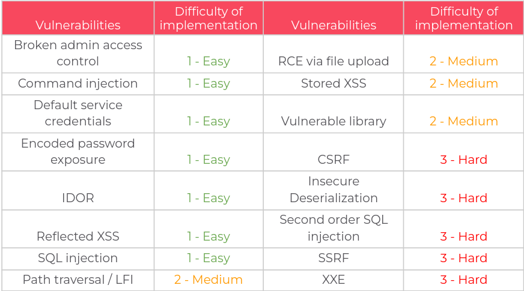

# wargameG5
Site vulnérable pour le wargame 2024 des M2 Cyber - ISEN Nantes.


## Description du projet

Le projet Wargame est un travail de groupe par 2 ou 3 personnes. Chaque groupe doit créer un site web avec au moins 3 vulnérabilités spécifiques *(une de chaque catégorie)* parmi les 16 suivantes : 



Une fois le site créé, chaque groupe devra identifier et exploiter les vulnérabilités sur les applications des autres groupes.

### Objectifs
1. **Création de site vulnérable** 
2. **Recherche & Exploitation des vulnérabilités sur le site d'un autre groupe** 

## Technologies utilisées

Le choix des technologies utilisées pour notre groupe : 

- **Frontend** : HTML, CSS, JavaScript (JQuery et Ajax)
- **Backend** : PHP
- **Database** : PostgreSQL
- **Docker** : Pour containeriser l'application et faciliter le déploiement


## Prérequis

Avant de commencer, assurez-vous d'avoir installé Docker et docker-compose sur votre machine. Si besoin le lien du [site officiel](https://www.docker.com/get-started).

## Setup 

### 1. Cloner le projet

Clonez ce projet sur votre machine locale.

```bash
git clone https://github.com/Mart-1/wargameG5
cd wargameG5
```

### 2. Lancez votre instance docker

```bash
docker-compose up --build

```

### 3. Accedez ensuite à l'application

L'instance docker est lancée sur le port 8080 et est configurée pour être accessible depuis [http://localhost:8080/](http://localhost:8080/).

## Auteurs
**Groupe 5**:
- **Martin L.**
- **Enzo P.**
- **Noa V.**